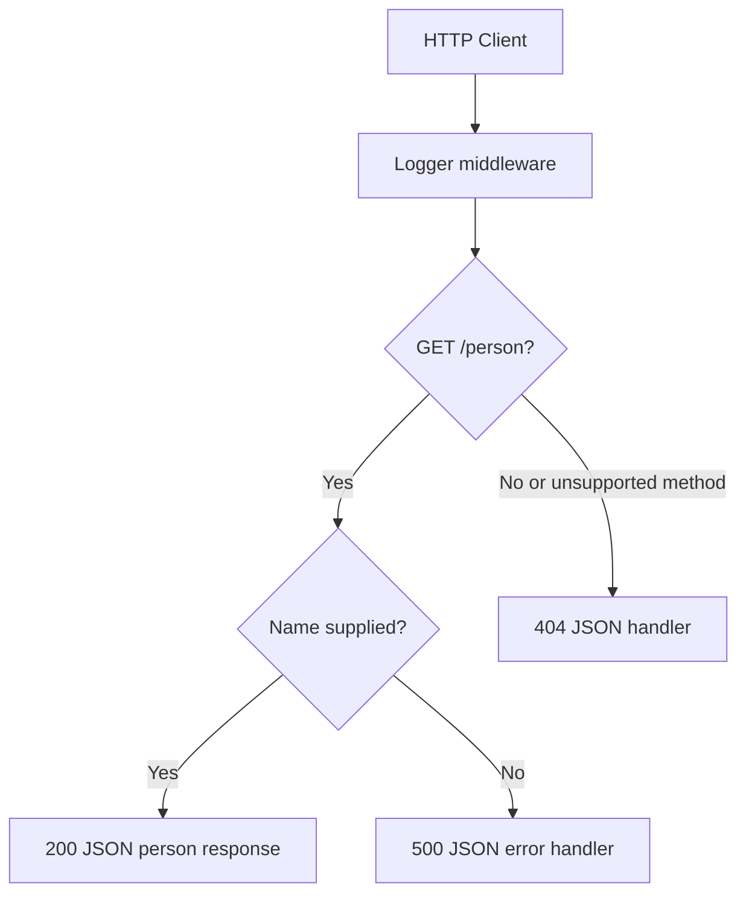

# Basic Express Server

A modular CommonJS Express server for Code 401 Lab 2. It demonstrates application-level logging, query validation, JSON error handling, automated tests, and continuous integration.

## Setup

Requirements:

- Node.js 20
- npm

Install the locked dependencies:

```bash
npm ci
```

Create a local `.env` file if one is not already present:

```text
PORT=3000
```

Both `.env` and `node_modules/` are ignored so local configuration and installed packages are not added to source control.

## Usage

Start the application:

```bash
npm start
```

The server listens on `http://localhost:3000` by default. Request a person by providing the required `name` query parameter:

```bash
curl "http://localhost:3000/person?name=Ada"
```

Response:

```json
{
  "name": "Ada"
}
```

## Testing

Run the Jest unit and integration test suite with coverage:

```bash
npm test
```

The suite uses Supertest for HTTP integration tests. It covers unknown routes, unsupported methods, validation failure, successful requests, the response body, and both custom middleware modules.

## API

### `GET /person`

Returns a person object from the required query parameter.

| Query parameter | Required | Description |
| --- | --- | --- |
| `name` | Yes | Name returned by the API |

Successful response — `200 OK`:

```json
{
  "name": "Ada"
}
```

Missing `name` response — `500 Internal Server Error`:

```json
{
  "status": 500,
  "message": "Name is required"
}
```

Unknown route or unsupported method — `404 Not Found`:

```json
{
  "status": 404,
  "message": "Not Found"
}
```

## UML



## Deployment

- Pull request: [https://github.com/AGiv-lab/basic-express-server/pull/1](https://github.com/AGiv-lab/basic-express-server/pull/1)
- Render deployment: [https://basic-express-server-20xs.onrender.com](https://basic-express-server-20xs.onrender.com)
